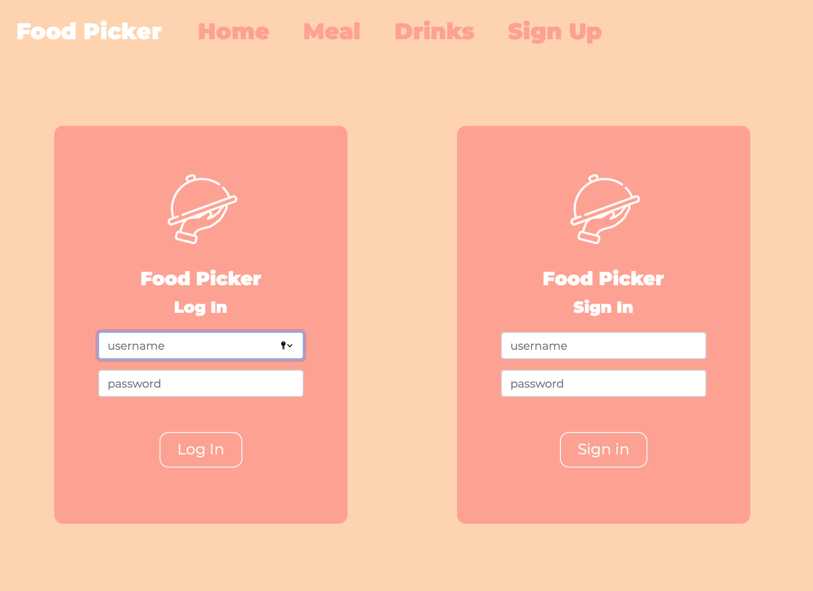

# Food Picker Website

## Overview

Dynamic and responsive website aiming to help users to decide what to eat or drink.
User can register to the website and save the city where they are or live and select their diet preferences for a more tailor experience. OpenWeather API is used to query the weather description and temperature (in degree) of the city entered in order to tailor the meals and drinks option according to it.

The website has been deployed on Heroku.

https://salty-mountain-49124.herokuapp.com

## Technologies

* Front-end :
  * HTML
  * CSS
  * Javascript
  * Jquery
  * Boostrap - version 5.0

* Back-end :
  * Node.JS - version 14.17
  * ejs
  * moongose

* DataBase:
  * MongoDB - version 4.4.5

* API:
  * [OpenWeather API](https://openweathermap.org/api)

## Usage

On the home page, scroll down and click either on the button next to feeling hungry section to get a meal. Or if you are feeling thirsty, click on the button next to this section.
For a customised experience, go to the login page and register. At the registration stage, enter a username and a password (both are required) then press submit. The preference page is then loaded, fill the user preference form by entering the city where you live or currently are, and selection your diets (several diets can be selected.
The user data are saved on MongoDB database.

**Start the program**
```
node app.js
```

## Images





## Security

The passwords will be encrypted and decrypted transparently with moongose-encrypter during save and find.
Passwords are hashed using bcrypt password-hashing function
For security reason, please DO NOT choose a password that you are using for sensitive content.

To read more check this post from Coda Hale: https://codahale.com/how-to-safely-store-a-password/


### Credit

Icons made by [Freepik](https://www.freepik.com) Freepik from [Flaticon](https://www.flaticon.com)  www.flaticon.com


### ToDo:

* Perform tests and write unit test
* Add feature to enable users to update their city and preferences
* add feature to handle the case when several users use the same username
* Add feature to allow users to delete their account
* Add country feature to proper location of the city for API

### Contact

Created by aude11
